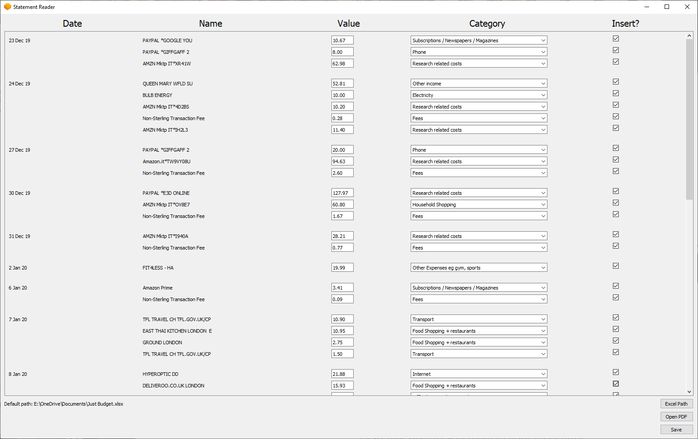

This is a python project that:

- Retrieves payment data from the bank statement's pdf
- Opens a GUI where the payments can be divided in categories
- Saves the data to the main budgeting excel file

The libraries used were PyQT, fbs (PyInstaller for PyQT), pandas (numpy extension), openpyxl, PyPDF2, xlrd 

This is the windows version of the developing environment, will not work on other operating systems
Due to upload contraints the python virtual environment folder will not contain the prerequisite libraries,
if the program has to be modified first download the library then run the program using "fbs run" while in
the virtual environment.
The executable file will is standalone and will run anyways.
For the data to be parsed properly, the file needs to be a PDF statement from HSBC.

The main program files are saved in src/main/python as specified by the fbs launcher
The virtual environment libraries are saved in /venv (platform dependent)
The executable files are saved in /target (platform dependent)

Example of user interface

